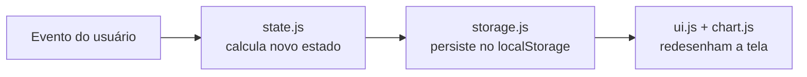

# 💰 Dashboard de Gestão de Gastos e Finanças Pessoais


Aplicação **front-end 100% Vanilla** (sem frameworks e sem build tools) para controle de gastos e finanças pessoais, desenvolvida como projeto de estudo e portfólio. O objetivo central é praticar **HTML5 semântico**, **CSS3 moderno** (Flexbox, Grid, variáveis, Dark Mode) e **JavaScript ES6+ Modules**, aplicando boas práticas de **Clean Code** e **Acessibilidade (WCAG 2.2)**.

> ⚠️ Este é um projeto client-side: todos os dados ficam armazenados **apenas no navegador** (`localStorage`), não há backend nem envio de dados para servidores externos.

> 🚫 **Não abra o `index.html` com duplo clique.** O projeto usa ES Modules (`import`/`export`), que os navegadores bloqueiam por política de CORS quando o arquivo é aberto via `file://`. Sirva a pasta por HTTP — veja a seção [Como Executar](#-como-executar-o-projeto).

---

## 📸 Visão Geral

O dashboard permite:

- Cadastrar transações (entradas e saídas) com descrição, valor, categoria e data;
- Visualizar em tempo real o **saldo atual**, o **total de entradas** e o **total de saídas**;
- Consultar um **gráfico de pizza** (Chart.js) com a distribuição dos gastos por categoria;
- Consultar um **histórico completo** em tabela, com opção de exclusão de lançamentos;
- Alternar entre **tema claro e escuro**, com preferência salva entre sessões;
- Continuar de onde parou: todos os dados persistem no `localStorage`, mesmo após recarregar a página.

---

## ✨ Funcionalidades

- ✅ Cadastro de transações com validação de formulário (nativa + customizada)
- ✅ Cálculo automático de saldo, entradas e saídas
- ✅ Gráfico de pizza reativo por categoria de gasto (Chart.js)
- ✅ Tabela de histórico com exclusão individual de transações
- ✅ Persistência local via `localStorage` (dados sobrevivem ao F5)
- ✅ Dark Mode / Light Mode com detecção da preferência do sistema operacional
- ✅ Totalmente responsivo (mobile-first, com CSS Grid)
- ✅ Navegável 100% por teclado, com Skip Link e foco visível
- ✅ Atualizações de saldo anunciadas via `aria-live` para leitores de tela

---

## 🛠️ Tecnologias Utilizadas

| Tecnologia | Uso no projeto |
|---|---|
| **HTML5** | Estrutura semântica (`header`, `main`, `section`, `article`, `table`), formulários acessíveis |
| **CSS3** | Variáveis CSS (Design Tokens), Flexbox, Grid, Dark Mode, `:focus-visible` |
| **JavaScript (ES6+)** | Módulos nativos (`import`/`export`), funções puras, manipulação de DOM, `localStorage` |
| **Chart.js** (via CDN) | Renderização do gráfico de pizza por categoria |
| **Intl API** | Formatação de moeda (`Intl.NumberFormat`) em Real (BRL) |

Nenhum framework, bundler ou gerenciador de pacotes é necessário para rodar o projeto.

---

## 📁 Estrutura de Pastas

```
app-financas-pessoais/
├── README.md                # Este arquivo
├── index.html                # Página única da aplicação (SPA simples)
├── assets/
│   ├── css/
│   │   ├── global.css        # Reset, variáveis de tema, utilitários de acessibilidade
│   │   ├── layout.css        # Header, grid principal e áreas do dashboard
│   │   └── components.css    # Cards, formulário, tabela e gráfico
│   └── images/                # Ícones/imagens estáticas do projeto
└── src/
    ├── js/
    │   ├── app.js             # Ponto de entrada: liga eventos do DOM aos módulos
    │   ├── storage.js         # Camada de persistência (localStorage)
    │   ├── state.js           # Regras de negócio: adicionar/remover/calcular
    │   ├── ui.js               # Renderização da tabela, cards e Dark Mode
    │   └── chart.js            # Inicialização e atualização do Chart.js
    └── utils/
        └── helpers.js          # Formatação de moeda (BRL) e datas
```

### Por que essa arquitetura?

O projeto segue uma separação de responsabilidades inspirada em arquiteturas **Flux/MVC**, mesmo sem usar nenhum framework:

- **`storage.js`** — única camada que conversa com o `localStorage`. Se a persistência mudar no futuro (ex.: API REST), só este arquivo precisa ser reescrito.
- **`state.js`** — contém apenas **funções puras**: recebem dados e retornam novos dados, sem tocar no DOM ou no `localStorage`. Isso facilita testes e raciocínio sobre o código.
- **`ui.js`** — a única camada que manipula o DOM diretamente (criação de elementos, atualização de texto, Dark Mode).
- **`chart.js`** — isola toda a dependência da biblioteca Chart.js, para que trocar de biblioteca de gráficos no futuro não afete o restante da aplicação.
- **`app.js`** — o "maestro": importa todos os módulos acima e conecta eventos do usuário (submeter formulário, clicar em excluir, alternar tema) ao fluxo de dados.

**Fluxo de dados unidirecional:**



---

## ♿ Acessibilidade (WCAG 2.2)

Práticas aplicadas no projeto:

- **Skip Link** (`2.4.1 Bypass Blocks`): link oculto que aparece ao pressionar `Tab`, permitindo pular direto para o conteúdo principal.
- **Regiões `aria-live="polite"`**: os cards de resumo (saldo, entradas, saídas) anunciam atualizações automaticamente para leitores de tela, sem precisar de interação extra.
- **Labels explícitos**: todo campo do formulário possui `<label for="...">` associado ao respectivo `id`, essencial para tecnologia assistiva.
- **Mensagens de erro com `role="alert"`**: erros de validação são anunciados no momento em que aparecem.
- **HTML semântico**: uso de `<header>`, `<main>`, `<section>`, `<article>`, `<table>` com `scope="col"` nos cabeçalhos, e `<caption class="sr-only">` descrevendo a tabela.
- **Foco visível explícito** (`2.4.11 Focus Not Obscured`): anel de foco customizado via `:focus-visible`, garantido em ambos os temas (claro/escuro) com contraste adequado.
- **`aria-pressed` e `aria-label` dinâmicos** no botão de tema, comunicando o estado atual (ligado/desligado) e a ação disponível.
- **Sem `innerHTML` com dados do usuário**: toda renderização de conteúdo dinâmico usa `textContent`/`createElement`, prevenindo XSS e mantendo compatibilidade com boas práticas de segurança (OWASP).

---

## 🧹 Boas Práticas de Clean Code

- Funções pequenas e com **responsabilidade única** (SRP).
- **Imutabilidade**: `state.js` nunca modifica arrays recebidos, sempre retorna novas cópias (`[...array]`, `.filter()`, `.map()`).
- **Nomes descritivos em português**, priorizando legibilidade para quem está estudando o código.
- **Comentários com propósito**: documentam o *porquê* das decisões técnicas, não apenas o *o quê* o código faz.
- **JSDoc** em todas as funções exportadas, incluindo tipos (`@param`, `@returns`, `@typedef`).
- **Sem variáveis globais desnecessárias**: cada módulo expõe apenas o que é preciso via `export`.

---

## 🚀 Como Executar o Projeto

Este projeto **não depende de Node.js, npm ou qualquer build tool**. Por usar ES6 Modules (`import`/`export`), o navegador exige que os arquivos sejam servidos via `http://`, e não abertos diretamente como `file://`.

### Opção 1 — Extensão Live Server (VS Code)

1. Instale a extensão **Live Server** no VS Code.
2. Clique com o botão direito em `index.html` → **Open with Live Server**.

### Opção 2 — Servidor local com Python

```bash
# Dentro da pasta do projeto
python -m http.server 8000
```

Acesse `http://localhost:8000` no navegador.

### Opção 3 — Servidor local com Node.js

```bash
npx serve .
```

---

## 🗺️ Possíveis Evoluções Futuras

- [ ] Edição de transações existentes (atualmente só é possível excluir e recadastrar)
- [ ] Filtros por período (mês/ano) e por categoria na tabela
- [ ] Exportação dos dados para CSV/PDF
- [ ] Testes automatizados (unitários) para os módulos de `state.js` e `utils/helpers.js`
- [ ] Internacionalização (i18n) para outros idiomas/moedas

